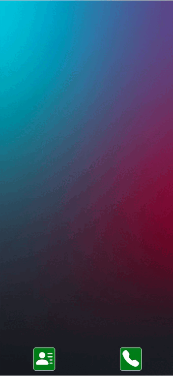

## Overview

Hey! Here is a pet-project of microfrontend app concept inspired by ios.

- /contacts-app - Contacts List app
- /phone-app - App to make a call
- /smartphone-app - Container app that looks like mobile os and run apps.

Idea is next:

- you can run several apps (Contacts, Phone) and close them.
- you can switch between apps, select an active app.
- apps can communicate between each other throung EventBus and container app.

Communication between apps is done through EventBus.
To test it run contacts app, then click 'call' button, you will see phone app run with call started to particular contact.

## How to run

/smartphone-app is a container so first step is to navigate here

- cd /smartphone-app
- npm i
- npm run install-all
- npm run build-all
- npm run start-all

To test app click 'Toggle device toolbar' to make it look like on smartphone. (Ctrl + Shift + M)
